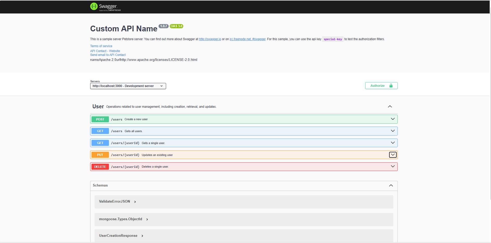
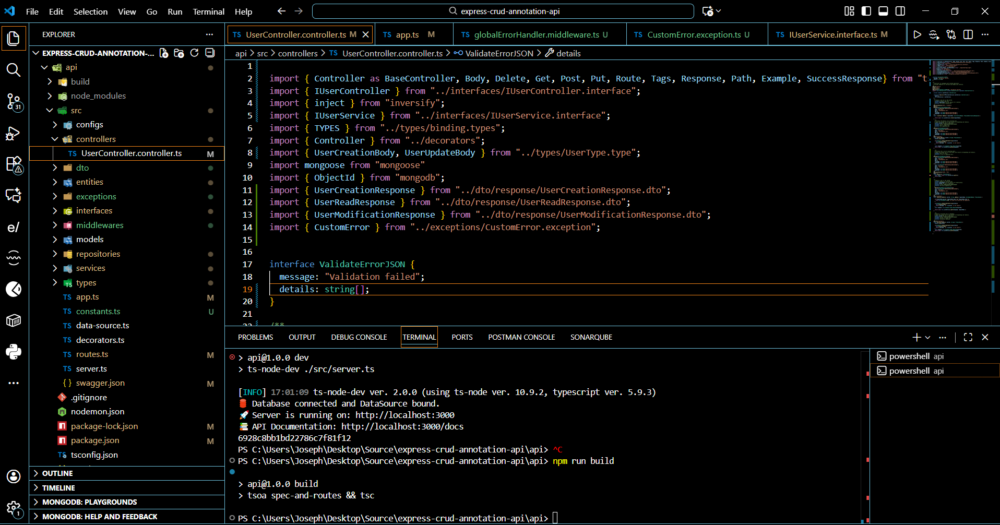
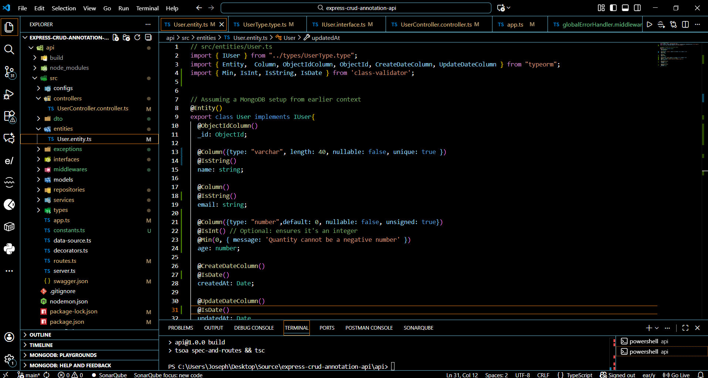
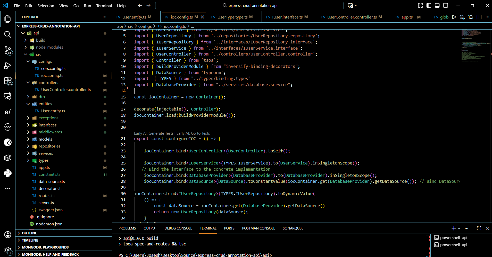
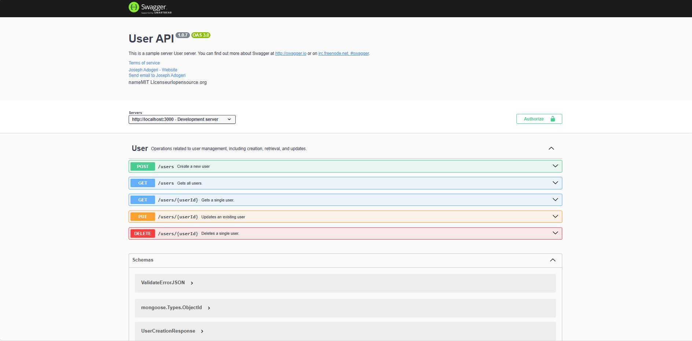
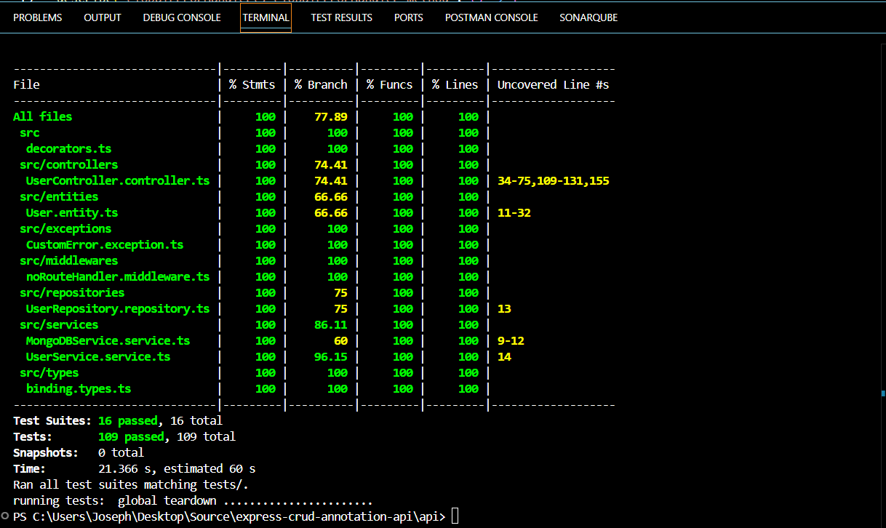

## **Express CRUD Annotation API**

**Version:** 1.10.0
**Date:** November 27, 2025

---

## Description

This is a backend Application temnplate implemting tsoa, typeorm, inversion of control, dependency injection and inversify.

## Authors

- [@jadogeri](https://www.github.com/jadogeri)

## Repository

- [source code ](https://github.com/jadogeri/express-crud-annotation-api.git)

## Environment Variables 

Note: use file .env.sample as template (or rename to .env) for global variables.
Note: make sure port used is same in tsoa.json.

## Screenshots

---

|  |  |
| -------------------------------------------- | -------------------------------------------- |
|  |  |

## Table of Contents

<ul>
    <li><a href="#1-introduction">1. Introduction</a>
      <ul>
        <li><a href="#11-purpose">1.1 Purpose</a> </li>
      </ul>
    </li>
    <li><a href="#2-installation">2. Installation</a>  </li>
    <li><a href="#3-usage">3. Usage</a>
      <ul>
          <li><a href="#31-run-application">3.1 Run Application</a> </li>
          <ul>
            <li><a href="#311-run-locally">3.1.1 Run Locally</a> </li>
          </ul>
      </ul>
    </li>
    <li><a href="#4-api-documentation">4. API Documentation</a> </li>
    <li><a href="#5-tests">5. Tests</a> </li>
    <li><a href="#6-references">6. References</a> </li>
</ul>

## **1. Introduction**

### **1.1 Purpose**

This document outlines the components, and design considerations for functionality to express application.

## **2. Installation**

* [Download and install NodeJS](https://nodejs.org/en/download)

---

## **3. Usage**

**Prerequisites** :installation of NodeJS.

### **3.1 Run Application**

1 Open command prompt or terminal.

2 Type command git clone https://github.com/jadogeri/express-crud-annotation-api.git then press enter.

```bash
  git clone https://github.com/jadogeri/express-crud-annotation-api.git
```

3 Enter command cd express-crud-annotation-api/api then press enter.

```bash
  cd express-crud-annotation-api/api
```

#### **3.1.1 Run Locally**

1 Type npm install --force to install dependencies.

```bash
  npm install --force
```

2 Type npm run dev to run application

```bash
  npm run dev
```
---

#### 4 API Documentation ####

OpenAI swagger documentation is available on http://localhost:{{port}}/docs.

Default url is http://localhost:3000/docs while app is running .



#### 5 Tests ####

2 Type npm run test to run tests

```bash
  npm run test
```




## **6. References**
* npm : [IoC Container for Typescript - 3.X)](https://www.npmjs.com/package/typescript-ioc).
* FreeCodeCamp : [Frontend Web Development: (HTML, CSS, JavaScript, TypeScript, React)](https://www.youtube.com/watch?v=MsnQ5uepIa).
* AweSome Open Source : [Awesome Readme Templates](https://awesomeopensource.com/project/elangosundar/awesome-README-templates)
* Readme.so : [The easiest way to create a README](https://readme.so/)
* HUXN Webdev : [Master ReactJS in 7 Hours with 10 Real-World Projects 2023](https://www.youtube.com/watch?v=XrwsMN2IWnE/)
* Dave Gray : [React JS Full Course for Beginners | Complete All-in-One Tutorial | 9 Hours](https://www.youtube.com/watch?v=RVFAyFWO4go/)
* Dipesh Malvia : [Learn React JS with Project in 2 Hours | React Tutorial for Beginners | React Project Crash Course](https://www.youtube.com/watch?v=0riHps91AzE/)

